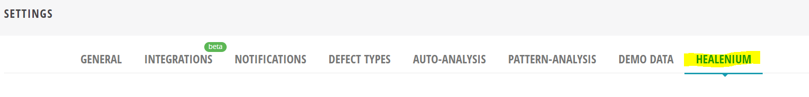
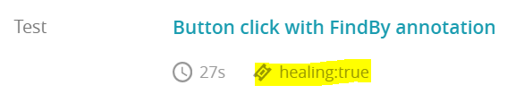
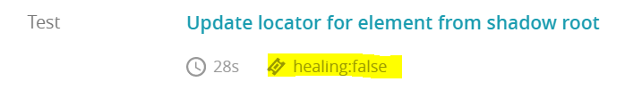

# Healenium plugin for ReportPortal

Healenium plugin for ReportPortal is an easy way to sort your test results to analyze changes in design locators for a time.

## Build instruction:

1. Clone current repository for plugin and build project to jar or Download jar asset from releases https://github.com/healenium/healenium-plugin-reportportal/releases 

2. Upload received file to Report Portal using following instruction: https://reportportal.io/docs/Plugins
   
   Also, you can find helpful instructions for uploading jar files into Report Portal here: https://github.com/reportportal/reportportal/issues/680
   
## Usage

* Make Healenium plugin Enabled on Report Portal

   Than it will be available for your project
  
  
* Run your automation tests
* In case when healing has been run and passed test attributes on RP will be like:

* In case when healing has been run and failed test attributes on RP will be like:

  
* In case if healing is not necessary there will be no related attributes 
